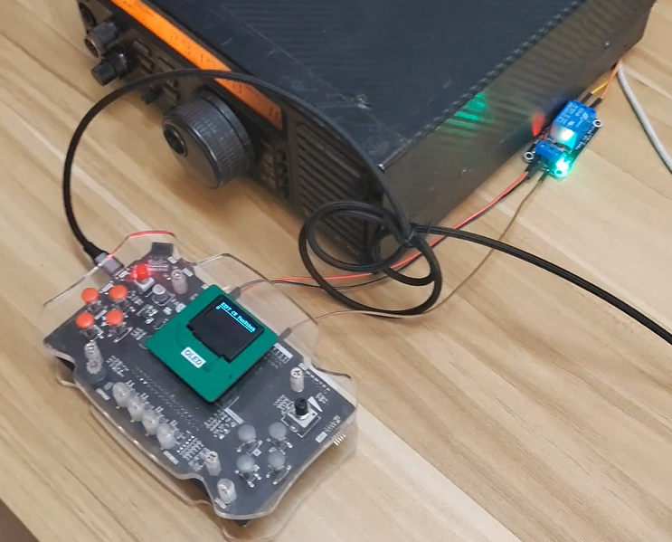
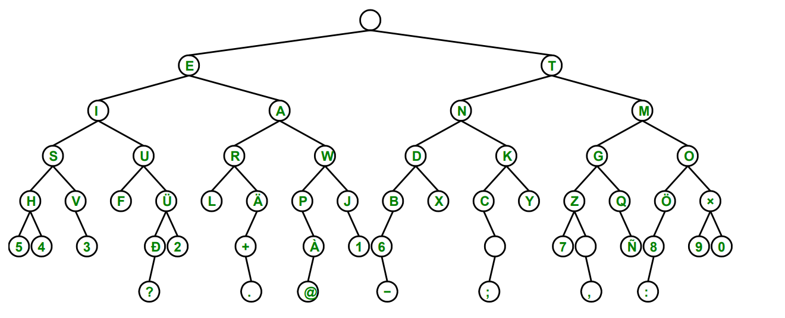

# CW-keyer 自述文档

CW-kyer 是用 blazar MKL25Z128XXX4 开发板 实现的一个半自动电键. 该电键可以接受用户输入的点划, 并将其解码为字符显示在屏幕上. 也可以通过自定义 GPIO 连接 3.3v 继电器, 引脚 PTE3, 控制电台发送 Morse 电码.



这里 `src` 打包的是 Freescale Code Warrior 项目中的 `Sources` 文件夹, 编码为 UTF8 格式. 其他工程文件夹中的文件没有打包.

## CAHNGELOG

在课堂演示过后, 我又完成了以下功能, 以让项目更加完整:

- 从 ADC 读入电阻值, 用来调整 `DOT_D` 的时长, 从而可以控制产生和发送信号的快慢.
- 在 OLED 屏幕上滚动显示当前的脉冲波形

演示这两个功能的[补充演示视频](./assets/demo.mp4)放在 `assets` 目录下.

## 程序结构说明

| 文件        | 功能                                                              |
| ----------- | ----------------------------------------------------------------- |
| `main.c`    | 主程序功能                                                        |
| `gpio.h`    | 启用所有将要用到的引脚                                            |
| `oled.h`    | OLED 绘制库, 我修改了其中的部分字符, 以便利于我实现显示脉冲的功能 |
| `speaker.h` | PWM 调制扬声器                                                    |
| `clk.h`     | 启用时钟                                                          |
| `morse.h`   | 存储 Morse 电码规范                                               |
|             | 将点划解码为字母数字                                              |
|             | 将字母数字编码为点划                                              |
| `adc.h`     | ADC 初始化和读入函数, 用来改变 `DOT_D` 的时长                     |

## 程序要点

`op_mode` 设定了 CW-keyer 的工作模式. 当 `op_mode` 为 `TX_MODE=1` 时, CW-keyer 将会发送 Morse 电码. 当 `op_mode` 为 `DECODE_MODE=0` 时, CW-keyer 将会接受用户输入, 将用户输入的电码解码为字符显示在屏幕上.

解码使用的数据结构为数组形式存储的二叉树



当用户按下发送键后, `op_mode` 被设为 `TX_MODE=1`, 进入发送模式, 发完电码后自动归位 `DOCODE_MODE=0`, 进入解码模式.

值得注意的是, 在发送式下, 屏幕会滚动显示当前发送的字符的脉冲形状.

在正常的解码模式中, 处理状态更新由 IO 中断和时钟中断控制. 例如用户输入点或者划, 那么有如下事件需要处理:

- 更新当前解码结果
- 点亮 LED
- 扬声器工作
- OLED 屏幕更新重绘
- 等待规定时间
- 熄灭 LED
- 扬声器停止工作
- 如果超时, 提交当前解码结果

以上所有状态, 或者说效果都在 IO 中断函数处注册:

```c
void PORTA_IRQHandler()
{
    if ((GPIOA_PDIR & (1 << 1)) == 0 && op_mode == DECODE_MODE) /* PTA1 Pressed */
    {
        if (effect_duration == 0)
        {
            register_buf_change();
            update_morse(DOT);
            dot_effect();
            oled_w_ch(buf_x, buf_y * 8, '.');
            post_buf_draw();
        }
        PORTA_PCR1 |= 0x01000000;
    }
    // ...
}
```
而有些状态和效果经过规定时间后需要取消或重置, 这可以在时钟中断函数处理:

```c
void SysTick_Handler()
{
    unsigned int i;
    blink_cnt++;
    if (effect_duration == 1)
        stop_effect();
    if (effect_duration > 0)
        effect_duration--;
    if (backspace_deshake > 0)
        backspace_deshake--;
    // ...
}
```

如此, 事件的逻辑和渲染就被分开了, 某个效果什么时候被取消, 由 `effect_duration` 在轮询中处理, 这样低耦合的编写方式降低了难度.

此外, 由于发送模式用时较长, 发送模式的代码被放在了 main 函数当中, 这是因为发送过程无法在一次中断中完成, 而不同时钟中断间保持状态又比较繁琐, 所以放在主循环中进行.

滚动显示波形的功能的实现关键是使用队列 `tx_buffer_queue` 存储所有正在绘制的波形数据, 当新波形需要加入时, 就将波形放入队列, 利用先进先出的特性实现波形从右侧飞到左侧. 为了达到粒度为 1 个像素的平滑滚动, 我使用了一个追踪 `effect_duration` 的变量 `tx_scroll_offset`, 通过以下代码计算偏移和绘制波形:

```c
void draw_wave()
{
    unsigned int i;
    char wave;
    tx_scroll_offset = 8 * (DOT_D - effect_duration) / DOT_D;
    for (i = 0; i < 17; i++)
    {
        wave = get_tx_buffer_queue(i);
        if (wave == SPACE)
            wave = ':';
        else
            wave = ';';
        if (i * 8 - tx_scroll_offset >= 0 && i * 8 - tx_scroll_offset <= 15 * 8)
            oled_w_ch(5, i * 8 - tx_scroll_offset, wave);
    }
}
```

其中 `':'` 和 `';'` 被我重新覆写了点阵表示, 以用来显示 `_` 和 `-` 这样的波形.

## 参考资料

- [Wiki - Morse Code](https://en.wikipedia.org/wiki/Morse_code)
